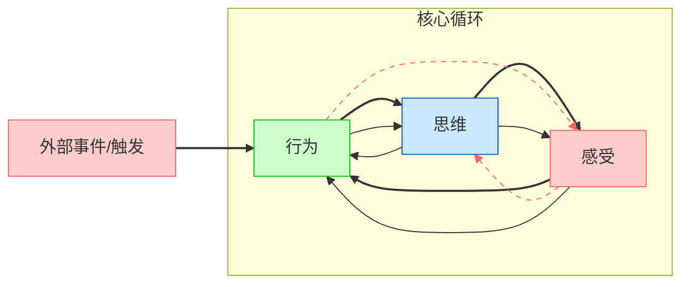

# [知否](https://github.com/coutureone/gitblog/issues/14)

​	好久没有写博客了， 最近这段时间的我去干嘛了呢，当然是去找我人生中的另一半去了，在这段日子里面喜怒哀愁各种都有吧，但是在这其中让我感受最深的是一种特别的`illness`，`depressive disorder（抑郁症）`。

​	对我个人来说，我在此之前也有接触过抑郁症患者，当时的接触让我感觉好像和我们普通人没有区别，但是当我深入接触以后，发现一切没有这么简单，我对于抑郁症患者是表示同情的，因为我查阅了大量的书籍和数据，很多抑郁症的患者都是和童年以及当下的生活状态息息相关，抑郁症当然也有遗传的因素在，但是相对来说是偏少的。经过一段时间的接触，我甚至去想考一个心里咨询师的想法，现在越来越多的学校也好，公益活动活动等，都会设立一个心里咨询站，抑郁症我个人觉得是从心里->精神->生理，这一系列相互影响的，可以理解为一个`CBT`模型，行为、思维、感受三者的一个循环。

​	    这种`CBT`模型也是最基础心理学应用场景，特别是对于抑郁症的人来说，经过我的接触，考虑问题的时候一定要站在他（她）的立场去思考问题，不管这个问题的对错，或者行为的对错，在处理事情的过程中如果你参与了，你觉得这种行为方式是不对的，请你不需要在当时表明你立场，你只需要在旁边的保持沉默即可，千万不能站在对立面，这样会瞬间激发他（她）的情绪，会让他（她）感受到伤害。

​	    抑郁症给我的个人感觉没有那么可怕，最难的是让我觉得如何帮助一个人状态走向正轨，摆脱心里和生理带来的伤害。从用药的减少到彻底剥脱药物，从一开始的躯体表现，到回归正常生活，从心里阴影到不再复发，这些东西我觉得不仅仅是心里医生或者是精神医生去研究的东西，而是我觉得我们每个人都应该学习的东西，不仅仅是为了他人，也是为了自己。

​	心灵就像是大海一样，蔚蓝浩瀚和波涛汹涌，希望每个人都能早日战胜自己的心魔，走出困境。

​															杭州.萧山

​															2025.7.11 中午

