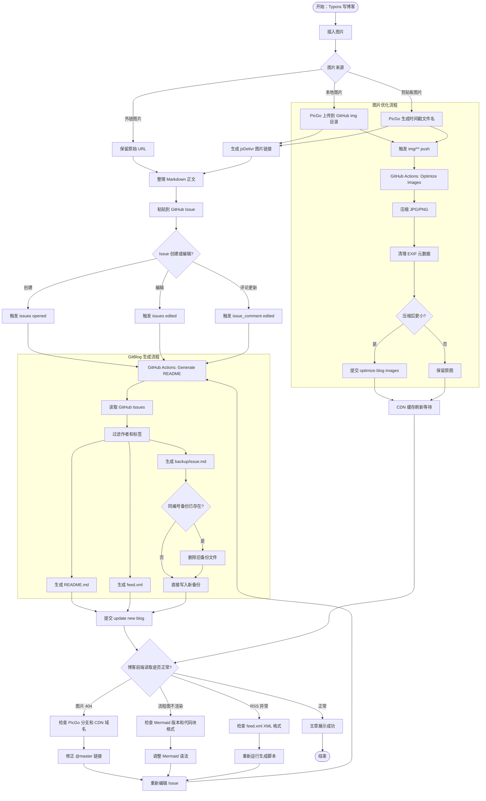

# [测试流程图](https://github.com/coutureone/gitblog/issues/43)

# 流程测试

测试流程图

```mermaid
flowchart TD
    A([开始：Typora 写博客]) --> B[插入图片]
    B --> C{图片来源}
    C -->|本地图片| D[PicGo 上传到 GitHub img 目录]
    C -->|外链图片| E[保留原始 URL]
    C -->|剪贴板图片| F[PicGo 生成时间戳文件名]

    D --> G[生成 jsDelivr 图片链接]
    F --> G
    E --> H[整理 Markdown 正文]
    G --> H

    H --> I[粘贴到 GitHub Issue]
    I --> J{Issue 创建或编辑?}
    J -->|创建| K[触发 issues opened]
    J -->|编辑| L[触发 issues edited]
    J -->|评论更新| M[触发 issue_comment edited]

    K --> N[GitHub Actions: Generate README]
    L --> N
    M --> N

    subgraph GEN[GitBlog 生成流程]
        N --> O[读取 GitHub Issues]
        O --> P[过滤作者和标签]
        P --> Q[生成 README.md]
        P --> R[生成 feed.xml]
        P --> S[生成 backup/issue.md]
        S --> T{同编号备份已存在?}
        T -->|是| U[删除旧备份文件]
        T -->|否| V[直接写入新备份]
        U --> V
    end

    subgraph IMG[图片优化流程]
        D --> W[触发 img/** push]
        F --> W
        W --> X[GitHub Actions: Optimize Images]
        X --> Y[压缩 JPG/PNG]
        Y --> Z[清理 EXIF 元数据]
        Z --> AA{压缩后更小?}
        AA -->|是| AB[提交 optimize blog images]
        AA -->|否| AC[保留原图]
    end

    Q --> AD[提交 update new blog]
    R --> AD
    V --> AD
    AB --> AE[CDN 缓存刷新等待]
    AC --> AE

    AD --> AF{博客前端读取是否正常?}
    AE --> AF

    AF -->|正常| AG[文章展示成功]
    AF -->|图片 404| AH[检查 PicGo 分支和 CDN 域名]
    AF -->|流程图不渲染| AI[检查 Mermaid 版本和代码块格式]
    AF -->|RSS 异常| AJ[检查 feed.xml XML 格式]

    AH --> AK[修正 @master 链接]
    AI --> AL[调整 Mermaid 语法]
    AJ --> AM[重新运行生成脚本]

    AK --> AN[重新编辑 Issue]
    AL --> AN
    AM --> AN
    AN --> N

    AG --> AO([结束])
```

